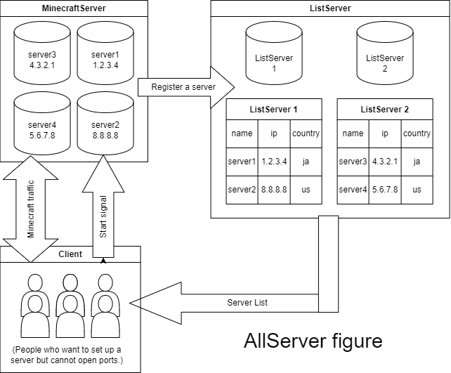

# AllServer Server
## Note
*Be sure to read this before creating and publishing your server.
- This system should be done with some understanding of server/internet knowledge.
  (For example: I have heard of cases where a server was set up, but there was a mistake in opening the ports and your computer became a stepping stone (basically a crime) for something.)
- The `allserver.py` here should be changed to the binary extension if it is a binary. (Linux has no extension).
- There are no rules for this AllServer other than the license.
  The rules are the server's own arrangements.
- This program may be very vulnerable.
- This program may have been written in the description but forgotten to actually implement it. (Sorry.)
- Be sure to be careful with the environment. (Are you using interfering ports? Do you have enough free memory?)

## Overview
AllServer is a minecraft server provisioning system that runs at very low cost and low load.

Even those who cannot open ports can set up a server for free!

Instead of concentrating on one server and running minecraft servers, this system randomly sets up minecraft servers on many supported servers.

There are two types of servers: servers that have a list of servers and servers where you can set up a Minecraft server.

Of course, "you" can also support a server, as long as you have the right memory and ports!

Figure

## Client & Server
If you cannot open a port but want to create a server, you can use "client" to create a server.

If you can open the port and have enough memory, you can use a "server" to assist you.

Alternatively, you can set up a "list server" that has the servers' information.

[Client](https://github.com/stsaria/allserver-client)
[Server](https://github.com/stsaria/allserver-server)
